# Отчёт по заданию 5: Аугментации и работа с изображениями

## Задание 1: Стандартные аугментации torchvision

Создан пайплайн стандартных аугментаций из библиотеки torchvision.transforms
| Аугментация             | Описание                                            | Параметры                                               |
|:------------------------|:----------------------------------------------------|:--------------------------------------------------------|
| `RandomHorizontalFlip`  | Случайное горизонтальное отражение                  | `p=1.0`                                                 |
| `RandomCrop`            | Случайная обрезка                                   | `200px, padding=20`                                     |
| `ColorJitter`           | Изменение яркости, контраста, насыщенности, оттенка | `brightness=0.5, contrast=0.5, saturation=0.5, hue=0.1` |
| `RandomRotation`        | Случайный поворот                                   | `degrees=30`                                            |
| `RandomGrayscale`       | Случайное преобразование в оттенки серого           | `p=1.0`                                                 |

Аугментации применены к 5 изображениям из разных классов. Для каждого изображения визуализированы:
* Оригинал
* Результат каждой аугментации отдельно (папка results/single/)
* 6 вариантов комбинированного применения всех аугментаций вместе (папка results/combined/)

##### _Результаты визуализации_

Пример результатов для класса Гароу:

Отдельные аугментации:

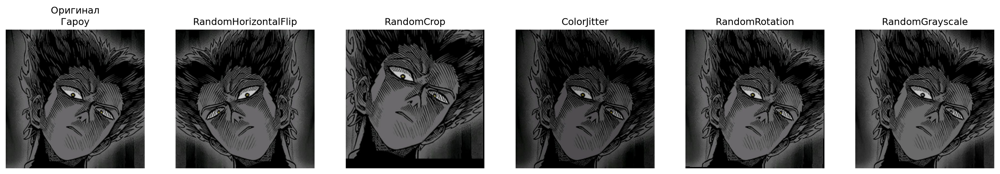
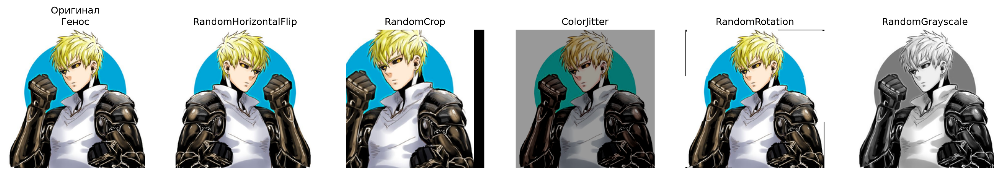

На изображении представлены: оригинал, RandomHorizontalFlip (отражение), RandomCrop (обрезка), ColorJitter (изменение цвета), RandomRotation (поворот), RandomGrayscale (оттенки серого).

Комбинированные аугментации:
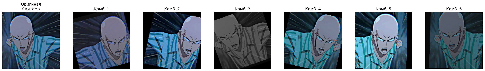
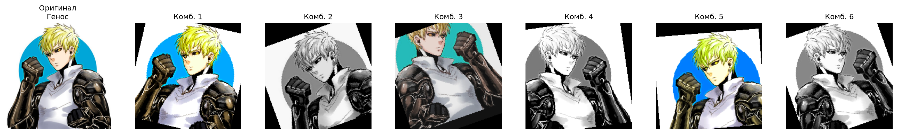
- Показаны 6 различных комбинаций всех пяти аугментаций, каждая из которых создаёт уникальный вариант изображения.

### **Выводы**
Каждая стандартная аугментация вносит свои изменения в изображение:
* HorizontalFlip — зеркальное отражение, сохраняет семантику объекта.
* Crop — фокусируется на части объекта, меняет композицию.
* ColorJitter — имитирует изменение освещения.
* Rotation — учит модель распознавать объекты под разными углами.
* Grayscale — заставляет модель не полагаться на цвет.

Комбинация аугментаций значительно увеличивает разнообразие данных, что должно положительно сказаться на обобщающей способности модели.

## Задание 2: Кастомные аугментации

Реализованы 3 кастомные аугментации:
| Аугментация                  | Описание                                | Параметры                                          |
|:-----------------------------|:----------------------------------------|:---------------------------------------------------|
| `RandomBlur`                 | Случайное размытие по Гауссу            | `radius=(2, 6), p=1.0`                             |
| `RandomPerspective`          | Случайное перспективное искажение       | `distortion_scale=0.3, p=1.0`                      |
| `RandomBrightnessContrast`   | Случайное изменение яркости и контраста | `brightness=(0.5, 1.5), contrast=(0.5, 1.5), p=1.0`|

Каждая аугментация применена к 6 изображениям (по 2 из 3 классов) и визуализирована вместе с оригиналом и готовыми аугментациями из extra_augs.py (GaussianNoise, ElasticTransform, Solarize).

##### Результаты визуализации. 

**Пример**

На изображении представлены:
Оригинал — исходное изображение.
Кастомные аугментации:
* RandomBlur — размытое изображение.
* RandomPerspective — искажённая перспектива.
* RandomBrightnessContrast — изменённые яркость и контраст.

Готовые аугментации из extra_augs:
* AddGaussianNoise — добавлен шум.
* ElasticTransform — эластичная деформация.
* Solarize — инвертирование ярких пикселей.

### **Выводы**
Кастомные аугментации позволяют гибко настраивать преобразования под конкретную задачу.
Визуальное сравнение показывает, что кастомные и готовые аугментации дополняют друг друга.
Все аугментации сохраняют семантику объекта, что важно для обучения.
Для повышения робастности модели рекомендуется комбинировать кастомные и стандартные аугментации.

## Задание 3: Анализ датасета

Проанализирован датасет по папке train. По каждому классу и размерам изображений собрана статистика

Количество изображений по классам:
| Класс          | Количество изображений |
|:---------------|:----------------------:|
| Гароу          |           30           |
| Генос          |           30           |
| Сайтама        |           30           |
| Соник          |           30           |
| Татсумаки      |           30           |
| Фубуки         |           30           |
| **Всего**      |        **180**         |

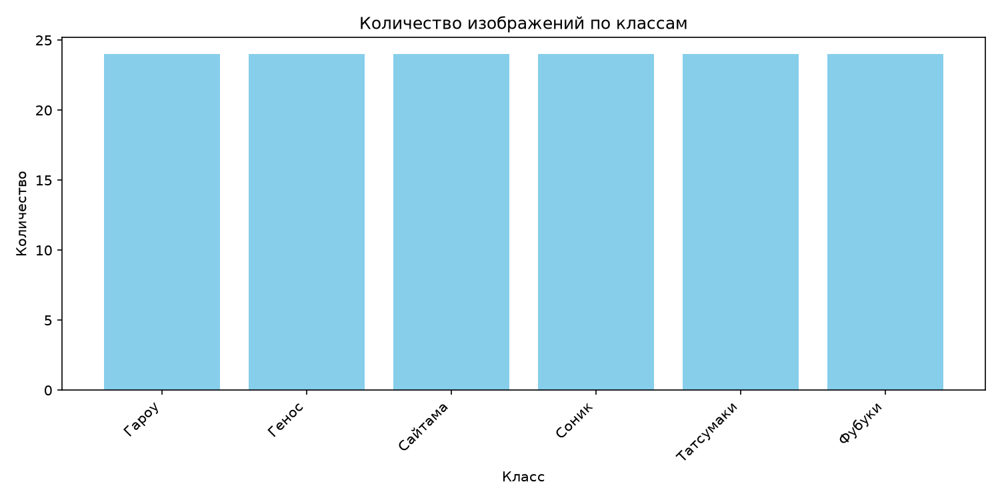

Размеры изображений:
| Параметр              | Значение        |
|:----------------------|:----------------|
| Минимальная ширина    | ~200 px         |
| Максимальная ширина   | ~700 px         |
| Минимальная высота    | ~200 px         |
| Максимальная высота   | ~1200 px        |
| Средний размер        | ~400 x 600 px   |

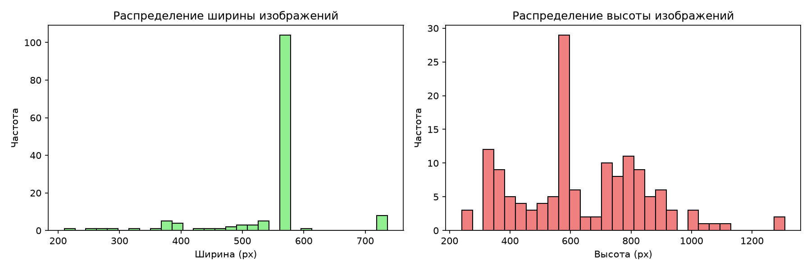

### **Выводы**
* Датасет небольшой (180 изображений), что увеличивает риск переобучения.
* Использование аугментаций критически важно.
* Распределение по классам равномерное, дисбаланс отсутствует.
* Изображения имеют разные размеры, поэтому требуется единый размер (224×224) для обучения.

## Задание 4: Pipeline аугментаций

Созданы три конфигурации:
| Конфигурация   | Аугментации                                                                              |
|:---------------|:-----------------------------------------------------------------------------------------|
| **Light**      | HorizontalFlip, SmallRotation (10°)                                                      |
| **Medium**     | HorizontalFlip, Rotation (20°), ColorJitter, RandomCrop                                  |
| **Heavy**      | HorizontalFlip, Rotation (20°), ColorJitter, RandomCrop, GaussianNoise, ElasticTransform |

##### Результаты визуализации

**Пример для класса Гароу:**

Light пайплайн:
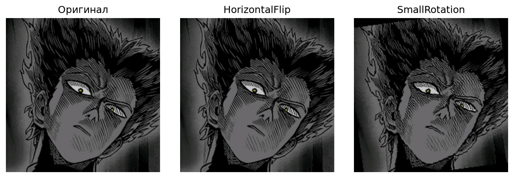

Medium пайплайн:
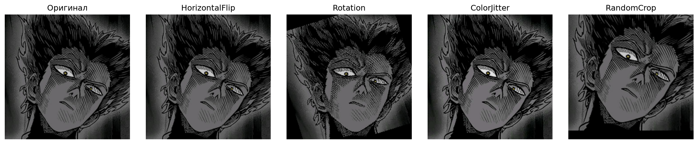

Heavy пайплайн:
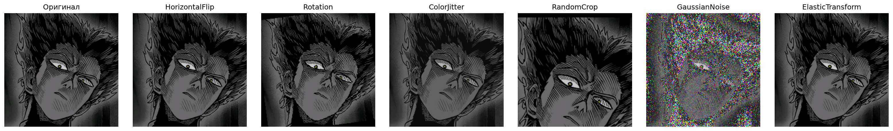

Каждый файл показывает оригинал и результат применения каждой аугментации из пайплайна.

Сравнение конфигураций:
| Конфигурация   | Количество аугментаций   | Степень изменения   | Влияние на данные                            |
|:---------------|:------------------------:|:-------------------:|:---------------------------------------------|
| **Light**      |            2             | Минимальная         | Сохраняет оригинальную структуру             |
| **Medium**     |            4             | Умеренная           | Значительное разнообразие                    |
| **Heavy**      |            6             | Максимальная        | Сильное изменение, борьба с переобучением    |

### **Выводы**
* Лёгкая конфигурация подходит для небольших датасетов или когда данные уже разнообразны.
* Средняя конфигурация — хороший баланс для большинства задач.
* Тяжёлая конфигурация рекомендуется при сильном переобучении, но может привести к потере значимых признаков.
* AugmentationPipeline удобен для управления аугментациями и быстрого переключения между режимами.

## Задание 5: Эксперимент с размерами

Таблица результатов
| Размер (px)   | Время загрузки (с)   | Время аугментаций (с)   | Память (МБ)   |
|:-------------:|:--------------------:|:-----------------------:|:-------------:|
| 64×64         | 0.000882             | 0.000453                | 0.05          |
| 128×128       | 0.001585             | 0.000455                | 0.19          |
| 224×224       | 0.001621             | 0.002251                | 0.57          |
| 512×512       | 0.003904             | 0.012152                | 3.00          |

График
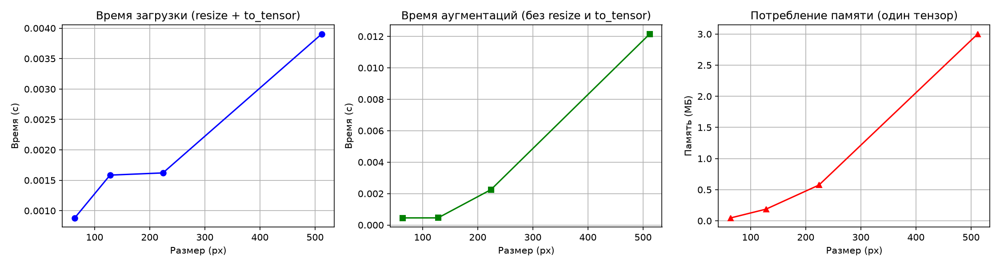

### **Анализ**

##### Время загрузки (resize + to_tensor):
Растёт с увеличением размера, особенно заметно при переходе с 224 на 512 (в 2.4 раза).
Для размеров 128 и 224 почти одинаковое (~0.0016 с).

##### Время аугментаций:
Для 64 и 128 практически одинаково (~0.00045 с).
Для 224 возрастает в 5 раз (0.00225 с).
Для 512 возрастает ещё в 5 раз (0.012 с).
Вывод: аугментации имеют вычислительную сложность, пропорциональную числу пикселей.

##### Потребление памяти:
Растёт квадратично с увеличением размера (пропорционально площади).
64→128: память увеличивается в 4 раза (0.05 → 0.19 МБ).
128→224: в 3 раза (0.19 → 0.57 МБ).
224→512: в 5 раз (0.57 → 3.00 МБ).

_Итого_
| Размер        | Рекомендация                                                               |
|:--------------|:---------------------------------------------------------------------------|
| **64×64**     | Для быстрых экспериментов, отладки                                         |
| **128×128**   | Хороший баланс скорости и качества                                         |
| **224×224**   | Стандарт для предобученных моделей (ResNet)                                |
| **512×512**   | Только при наличии мощного GPU и необходимости в деталях                   |

## Задание 6: Дообучение предобученных моделей

_Выполненные действия_
Загружена предобученная модель ResNet18 с весами ImageNet.
Заменён последний полносвязный слой на 6 классов датасета.
Модель дообучена на train (144 изображения) в течение 10 эпох.
Валидация на val (36 изображений).
Сохранены:
* Лучшая модель (best_model.pth).
* Кривые обучения (training_curves.png).
* Лог обучения (training_log.csv).

Таблица по эпохам
| Эпоха   | Train Loss   | Train Acc   | Val Loss   | Val Acc   |
|:-------:|:------------:|:-----------:|:----------:|:---------:|
| 1       | 1.411        | 0.368       | 7.005      | 0.278     |
| 2       | 0.333        | 0.910       | 2.364      | 0.417     |
| 3       | 0.178        | 0.944       | 6.047      | 0.306     |
| 4       | 0.233        | 0.938       | 6.091      | 0.306     |
| 5       | 0.304        | 0.910       | 2.285      | 0.500     |
| 6       | 0.064        | 0.979       | 1.071      | 0.694     |
| 7       | 0.063        | 0.979       | 0.676      | 0.750     |
| 8       | 0.165        | 0.944       | 0.394      | 0.806     |
| 9       | 0.053        | 0.986       | 0.329      | 0.833     |
| 10      | **0.031**    | **0.993**   | **0.305**  | **0.861** |

Кривые обучения:
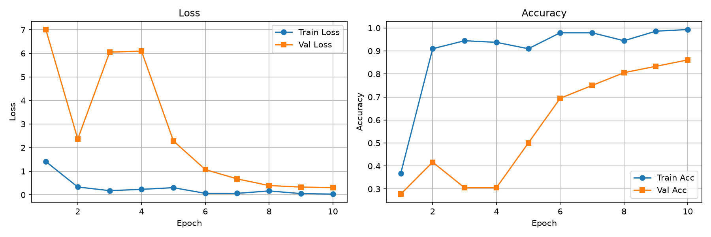

### _Анализ_

##### Train Accuracy:

Начало: 36.8% (эпоха 1) — модель только начинает адаптироваться.
К эпохе 6 достигает 97.9%.
К эпохе 10 достигает 99.3% — почти идеальное запоминание тренировочных данных.

##### Val Accuracy:

Начало: 27.8% (эпоха 1).
Постепенный рост до 86.1% (эпоха 10).
Лучший результат: 86.1% на валидации.

##### Train Loss:

Снижается с 1.41 до 0.031 за 10 эпох — модель успешно обучается.

##### Val Loss:

Колеблется, но в целом снижается.
На эпохах 3–4 наблюдается скачок (6.0), затем снижение.
К эпохе 10 достигает 0.305 — хороший результат.

##### Разрыв Train/Val:

Train Accuracy (99.3%) значительно выше Val Accuracy (86.1%) — это признак переобучения.
Причина: небольшой датасет (144 изображения).
Аугментации помогают, но не полностью решают проблему.

### Выводы

1. [ ] ResNet18 успешно адаптировалась под датасет героев.
2. [ ] Достигнута валидационная точность 86.1% — хороший результат для небольшого датасета.
3. [ ] Переобучение заметно, но в допустимых пределах.

### Ключевые выводы

* Аугментации — мощный инструмент для увеличения разнообразия данных и борьбы с переобучением.
* Стандартные аугментации (torchvision) просты в использовании и дают хороший эффект.
* Кастомные аугментации позволяют адаптировать преобразования под конкретную задачу.
* Пайплайны аугментаций удобны для управления и быстрого переключения между режимами.
* Размер изображений влияет на скорость и память: 224×224 — оптимальный для предобученных моделей.
* Предобученные модели (ResNet18) эффективно адаптируются к новым датасетам даже на малом объёме данных.
* Переобучение остаётся проблемой для небольших датасетов, но аугментации помогают его снизить.

